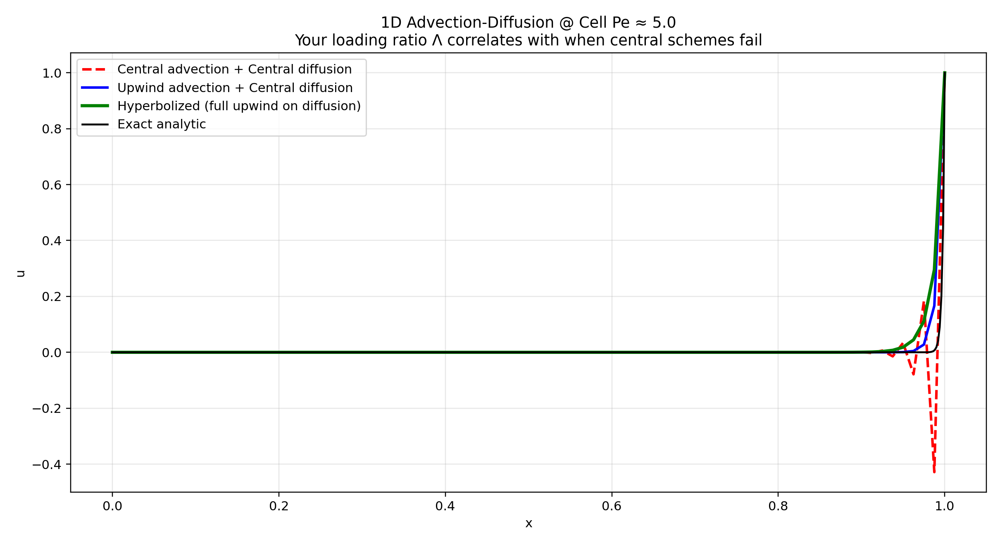

# 1D Advection–Diffusion: Hyperbolic (Nishikawa) Formulation

This directory contains a small, self‑contained numerical experiment comparing three steady 1D advection–diffusion discretizations on

\[
a\,u_x = \nu\,u_{xx},\quad x\in[0,1],\quad u(0)=0,\;u(1)=1,
\]

with constant advection velocity \(a>0\) and diffusion coefficient \(\nu>0\). For large \(|a|/\nu\), the exact solution develops a thin exponential boundary layer near \(x=1\).

The script of record is:

- `demo_hyperbolized.py` – central reference implementation

It computes:

1. **Central advection + central diffusion**
2. **Upwind advection + central diffusion**
3. **Nishikawa-style first‑order hyperbolic relaxation system** (fully upwind on the coupled [u, q] system)

and compares all three against the analytic solution.

---

## File Overview

- `demo_hyperbolized.py`  
  Main driver. Builds the three discrete operators, marches the hyperbolic system in pseudo‑time to steady state, prints diagnostics (including the “loading ratio”), and writes a comparison figure.

- `hyperbolic_advection_diffusion_demo.png`  
  Saved output figure from `demo_hyperbolized.py`, embedded below.

---

## Embedded Result Plot



### What the figure shows

The plot overlays four curves on \([0,1]\):

- **Black – Exact analytic solution**  
  Closed form for constant coefficients and Dirichlet BCs:
  \[
  u(x) = \frac{e^{\mathrm{Pe}\,x} - 1}{e^{\mathrm{Pe}} - 1},\quad \mathrm{Pe} = \frac{a}{\nu}.
  \]
  For the default parameters in the script (\(a=1\), \(\nu=0.0025\)), \(\mathrm{Pe}=400\) and the solution is essentially flat at 0 with a sharp exponential rise near \(x=1\).

- **Red dashed – Central advection + central diffusion**  
  Second‑order centered differences used for both first and second derivatives.  
  At high cell Péclet number \(\mathrm{Pe}_\text{cell} = a h / \nu \gg 1\), this scheme becomes non‑monotone: it produces spurious overshoots/undershoots (“wiggles”) in the boundary layer because the discrete operator loses M‑matrix properties. As the grid is refined, it converges in a classical sense, but the oscillations in the steep region are obvious at the resolutions shown.

- **Blue solid – Upwind advection + central diffusion**  
  First‑order upwind for \(u_x\), second‑order central for \(u_{xx}\).  
  The upwind advection term damps high‑frequency modes in the flow direction, removing the oscillations seen in the central scheme. The trade‑off is increased numerical diffusion: the boundary layer is thicker and the profile is visibly smeared compared to the exact curve, but the solution is monotone and convergent.

- **Green solid – Hyperbolic (Nishikawa) formulation**  
  First‑order hyperbolic relaxation system with auxiliary flux \(q\), solved in pseudo‑time with a Rusanov flux on the coupled state \(U = [u, q]^T\):

    - PDE system:
      \[
      u_t + (a u + q)_x = 0,\qquad
      \tau q_t + (\nu u)_x = -q.
      \]
      At steady state,
      \[
      q = -\nu u_x,\qquad (a u + q)_x = 0 \;\Rightarrow\; a u_x = \nu u_{xx},
      \]
      so the original second‑order equation is recovered exactly (no \(\tau\)‑dependent modeling error).

    - Numerical method:
        - Uniform grid on \([0,1]\) with spacing \(h\).
        - Relaxation time \(\tau \sim \mathcal{O}(h)\) (Nishikawa scaling).
        - Local Lax–Friedrichs (Rusanov) flux for the full 2×2 system, with wave‑speed bound
          \[
          s_{\max} = |a| + \sqrt{\nu/\tau}.
          \]
        - Explicit Euler in pseudo‑time with CFL \(dt \le 0.45\,h/s_{\max}\).
        - Dirichlet BC on \(u\), ghost‑cell extrapolation on \(q\).

  In the plot, the green curve tracks the exact exponential very closely without spurious oscillations, despite using a purely first‑order upwind flux. It resolves the boundary layer much better than the purely upwind advection formulation at the same grid.

---

## Loading Ratio Λ

The script prints a **loading ratio** Λ for each discrete solution:

\[
\Lambda = \frac{\text{TV}(u)\;\cdot\;\langle |a u_x| \rangle}{\nu\, \langle |u_{xx}| \rangle},
\]

where:

- \(\text{TV}(u) = \sum_i |u_{i+1} - u_i|\) is total variation,
- \(\langle |a u_x| \rangle\) is the mean magnitude of the advective “injection” term,
- \(\nu\,\langle |u_{xx}|\rangle\) is the mean magnitude of diffusive smoothing.

Interpretation:

- Large Λ → advection‑dominated, steep gradients and/or under‑diffusion.
- Small Λ → diffusion‑dominated, heavily smoothed profile.

Empirically:

- Central scheme: large Λ and visible oscillations in the boundary layer.
- Upwind advection: smaller Λ and monotone but overly diffused profile.
- Hyperbolic scheme: Λ consistent with the exact boundary layer, capturing the steep front without non‑physical overshoot.

---

## How to Run

From the repository root:

```bash
python -m advection_diffusion_loading_ratio.demo_hyperbolized
