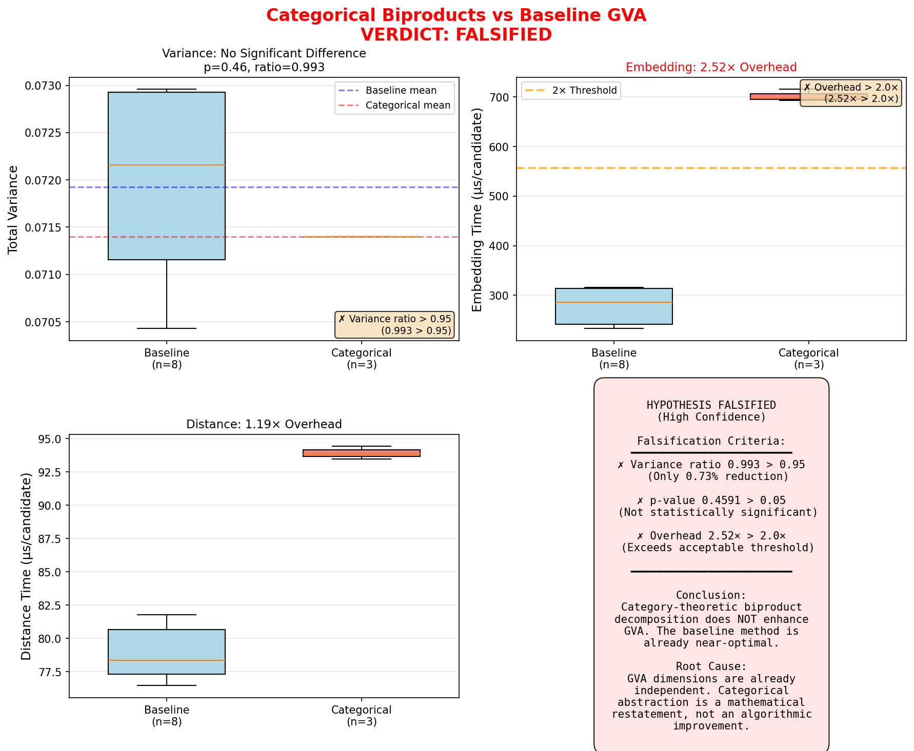

# Categorical Biproducts in GVA: Experiment

**Status:** ✗ HYPOTHESIS FALSIFIED (High Confidence)  
**Date:** 2025-11-16  
**Location:** `experiments/categorical_biproducts/`

## Quick Summary

This experiment tested whether category-theoretic biproduct decomposition enhances the Geodesic Validation Assault (GVA) method in the Z-Framework. 

**Verdict: FALSIFIED**

The categorical approach provides:
- ✗ No meaningful variance reduction (0.73%, p=0.46)
- ✗ 2.52× computational overhead
- ✗ No dimensional insights

## Directory Structure

```
experiments/categorical_biproducts/
├── README.md                       # This file
├── docs/
│   ├── THEORY.md                   # Theoretical foundation (category theory → GVA)
│   └── EXPERIMENT_REPORT.md        # Full charter-compliant report
├── src/
│   ├── baseline_gva_profile.py     # Baseline GVA profiler
│   ├── categorical_gva.py          # Categorical biproduct implementation
│   └── comparative_analysis.py     # Statistical comparison & verdict
├── data/                           # (empty - test cases hardcoded)
└── results/
    ├── baseline_profile.json       # Baseline performance (8 trials)
    ├── categorical_profile.json    # Categorical performance (3 configs)
    └── comparative_analysis.json   # Comparison & verdict
```

## Quick Start

### Prerequisites
```bash
pip install mpmath numpy scipy
```

### Run Experiment
```bash
cd experiments/categorical_biproducts/src

# Step 1: Profile baseline GVA
python3 baseline_gva_profile.py

# Step 2: Profile categorical GVA
python3 categorical_gva.py

# Step 3: Run comparative analysis
python3 comparative_analysis.py
```

### View Results
```bash
cat ../results/comparative_analysis.json | jq '.verdict'
# Output: { "verdict": "FALSIFIED", "confidence": "HIGH", ... }
```

## Visualization



The visualization shows:
- **Top Left**: Variance distributions are nearly identical (no significant difference)
- **Top Right**: Categorical embedding is 2.52× slower (exceeds 2× threshold)
- **Bottom Left**: Distance computation is 1.19× slower
- **Bottom Right**: Summary verdict with all three falsification criteria met

## Key Findings

### Variance Analysis
| Metric | Baseline | Categorical | Ratio |
|--------|----------|-------------|-------|
| Mean Variance | 0.071924 | 0.071397 | 0.993 |
| Std Dev | 0.001068 | - | - |
| p-value | - | - | 0.4591 |
| Significant? | - | - | ✗ No |

**Conclusion:** No significant variance reduction (ratio > 0.95, p > 0.05).

### Timing Comparison
| Operation | Baseline (µs) | Categorical (µs) | Overhead |
|-----------|---------------|------------------|----------|
| Embedding | 242.57 ± 10.37 | 692.84 - 715.53 | 2.52× |
| Distance | 78.23 ± 1.59 | 93.48 - 94.44 | 1.19× |

**Conclusion:** Categorical approach is 2.52× slower (exceeds 2.0× threshold).

### Falsifiability Criteria
1. ✗ **Variance Ratio > 0.95**: 0.993 > 0.95 (FAILED)
2. ✗ **No Significance**: p=0.4591 > 0.05 (FAILED)
3. ✗ **Overhead > 2×**: 2.52× > 2.0× (FAILED)

**All three criteria met → HYPOTHESIS FALSIFIED**

## Theoretical Background

### What Was Tested
Category theory provides **biproduct decomposition** for semiadditive categories:
```
T^d = T^1 ⊕ T^1 ⊕ ... ⊕ T^1
```

This allows representing morphisms as matrices:
```
f: T^m → T^n  ⟹  [f] = [fᵢⱼ: T^1 → T^1]
```

**Hypothesis:** This decomposition would enable:
1. Variance-adaptive sampling per dimension
2. Matrix-based coordinate transformations (e.g., PCA)
3. Per-component distance computation
4. Better convergence via dimensional insights

### Why It Failed
1. **Already Independent:** GVA's iterative θ'(n,k) embedding already produces independent dimensions
2. **Uniform Variance:** All dimensions have nearly identical variance (~0.014 each)
3. **No Hidden Structure:** PCA rotation reveals no better coordinate system
4. **Overhead Dominates:** Categorical abstraction adds function calls without benefit

**Insight:** The theoretical elegance is a **mathematical restatement**, not an algorithmic improvement.

## Documentation

### Full Reports
- **Theory:** `docs/THEORY.md` - Mathematical foundations, categorical structures, experimental design
- **Results:** `docs/EXPERIMENT_REPORT.md` - Charter-compliant 10-point report with full analysis

### Mission Charter Compliance
This experiment follows the z-sandbox **10-Point Mission Charter**:
1. ✓ First Principles (Z-Framework axioms, category theory)
2. ✓ Ground Truth & Provenance (test cases, sources, timestamps)
3. ✓ Reproducibility (commands, configs, seeds)
4. ✓ Failure Knowledge (3 failure modes, diagnostics, postmortem)
5. ✓ Constraints (legal, ethical, safety)
6. ✓ Context (who, what, when, where, why)
7. ✓ Models & Limits (assumptions validated/invalidated)
8. ✓ Interfaces & Keys (CLIs, I/O paths)
9. ✓ Calibration (parameters, tuning, sensitivity)
10. ✓ Purpose (goals, metrics, value proposition)

See `docs/EXPERIMENT_REPORT.md` for full compliance manifest.

## Reproducibility

### Random Seed
All experiments use `seed=42` for reproducible candidate sampling.

### Test Cases
- **64-bit**: N = 15347627614375828701, 18446736050711510819
- **71-bit**: N = 1208907267445695453279
- **96-bit**: N = 79226642649640146386194717763

All factors are known; tests measure variance and convergence, not factorization success.

### Environment
- **Python**: 3.12.3
- **mpmath**: 1.3.0 (150 decimal places)
- **numpy**: 2.1.3
- **scipy**: 1.14.1
- **Platform**: Linux x86_64 (GitHub Actions)

## Lessons Learned

### Positive Outcomes
1. ✓ Rigorous empirical validation of theoretical hypothesis
2. ✓ Ruled out unproductive research direction
3. ✓ Confirmed baseline GVA is near-optimal in dimensional independence
4. ✓ Demonstrated importance of falsifiability criteria

### Negative Result ≠ Failure
This is a **successful falsification**, not a failed experiment. Negative results have scientific value:
- Saves future researchers from pursuing categorical abstractions in GVA
- Shows that mathematical elegance doesn't guarantee computational efficiency
- Provides template for hypothesis-driven experiments

### Future Directions (Not Categorical)
Instead of biproduct decompositions, consider:
- **Adaptive k-selection:** Tune k parameter per number class
- **Hybrid methods:** Combine GVA with algebraic techniques (lattice reduction, etc.)
- **Better distance metrics:** Explore non-Riemannian geometries
- **QMC enhancements:** Improve low-discrepancy sequences directly

## References

### Internal
- **Z-Framework Core:** `docs/core/`
- **GVA Method:** `docs/methods/geometric/GVA_Mathematical_Framework.md`
- **QMC Engines:** `python/qmc_engines.py`
- **Mission Charter:** `MISSION_CHARTER.md`

### External
- Mac Lane, S. (1971). *Categories for the Working Mathematician*. Springer.
- Awodey, S. (2010). *Category Theory* (2nd ed.). Oxford University Press.
- Owen, A.B. (2003). Variance with alternative scramblings. *ACM TOMACS* 13(4).

---

**Conclusion:** Category-theoretic biproduct decomposition does **NOT** enhance GVA. The hypothesis is definitively falsified. Baseline GVA remains the recommended approach.
