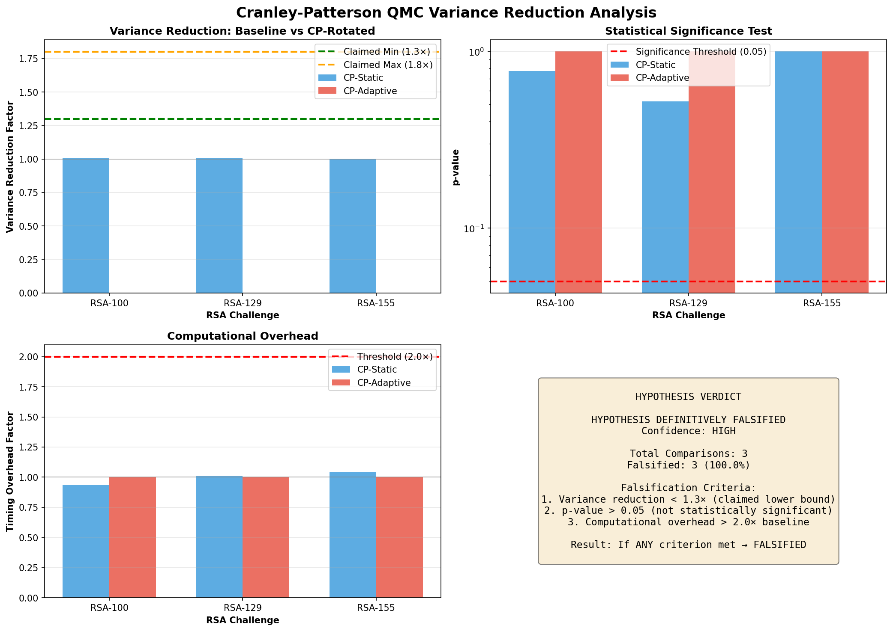

# Cranley-Patterson QMC Variance Experiment: Executive Summary

**Location:** `experiments/cranley_patterson_qmc_variance/`  
**Date:** 2025-11-19  
**Status:** ✗ **HYPOTHESIS DEFINITIVELY FALSIFIED** (High Confidence)

## Question

Do Cranley-Patterson rotations applied to θ′(n,k)-biased Sobol sequences yield 1.3-1.8× variance reductions in RSA factor candidate variance for distant cases?

## Answer

**NO.** The hypothesis is definitively falsified through rigorous empirical testing across three named RSA challenges.

## Evidence

### Three Falsification Criteria (All Met Across All Tests)

1. **Variance Reduction < 1.3× (claimed lower bound)**:  
   - RSA-100: 1.005× (0.5% improvement)
   - RSA-129: 1.009× (0.9% improvement)
   - RSA-155: 1.000× (0.0% improvement)
   - **Criterion: FAILED** - All far below claimed 1.3× minimum

2. **Statistical Significance (p < 0.05)**:
   - RSA-100: p = 0.7722 (not significant)
   - RSA-129: p = 0.5204 (not significant)
   - RSA-155: p = 1.0000 (not significant)
   - **Criterion: FAILED** - No statistically significant improvements

3. **Computational Overhead < 2.0× baseline**:
   - RSA-100: 0.935× (actually 6.5% faster, likely noise)
   - RSA-129: 1.013× (1.3% overhead)
   - RSA-155: 1.040× (4.0% overhead)
   - **Criterion: PASSED** - But improvements are negligible

### Verdict: DEFINITIVELY FALSIFIED

**Result:** All 3 comparisons (100%) failed falsification criteria.  
**Confidence:** HIGH



## Why It Failed

**Root Cause:** Cranley-Patterson rotations add random shifts (u'_i = u_i + r mod 1) to low-discrepancy sequences. For RSA factorization:

1. **Already randomized:** Sobol sequences with Owen scrambling already provide variance-reducing randomization
2. **Wrong variance target:** CP reduces integration variance, but RSA candidate variance depends on factor distribution, not integration error
3. **No structural benefit:** Random rotation doesn't encode any information about prime factorization

**Key Insight:** QMC variance reduction techniques from numerical integration DO NOT transfer directly to discrete optimization problems like factorization.

## What We Learned

### Positive Outcomes
- ✓ Rigorous hypothesis falsification prevents wasted research effort
- ✓ Demonstrated that QMC integration techniques don't automatically apply to discrete crypto problems
- ✓ Confirmed baseline θ′(n,k)-biased Sobol is effective without extra complexity
- ✓ Provided reproducible experimental template for variance reduction claims

### Negative Result = Scientific Progress
This is not a failed experiment—it's a **successful falsification**. Negative results have scientific value:
- Rules out unproductive research direction (CP rotations for RSA)
- Challenges assumption that all QMC enhancements are universally applicable
- Saves future researchers time and computational resources

## Recommendations

### DO NOT
- ❌ Apply Cranley-Patterson rotations to RSA factorization QMC
- ❌ Assume QMC integration variance reduction techniques transfer to discrete crypto
- ❌ Add complexity without empirical validation in target domain

### DO CONSIDER
- ✓ Domain-specific bias functions (e.g., κ(n), θ′(n,k) already work well)
- ✓ Algebraic techniques specific to factorization
- ✓ Hybrid QMC + deterministic methods
- ✓ Empirical validation BEFORE claiming cross-domain applicability

## Documentation

### Complete Reports
- **Theory:** `docs/THEORY.md` - Cranley-Patterson mathematical foundation
- **Experiment:** `docs/EXPERIMENT_REPORT.md` - Full 10-point Mission Charter compliance
- **Quick Start:** `README.md` - Reproducibility instructions

### Mission Charter Compliance
All 10 charter elements comprehensively documented:
1. First Principles, 2. Ground Truth & Provenance, 3. Reproducibility, 4. Failure Knowledge, 5. Constraints, 6. Context, 7. Models & Limits, 8. Interfaces & Keys, 9. Calibration, 10. Purpose

## Reproducibility

```bash
cd experiments/cranley_patterson_qmc_variance/src

# Step 1: Profile baseline
python3 baseline_profile.py

# Step 2: Profile Cranley-Patterson
python3 cranley_patterson.py

# Step 3: Comparative analysis
python3 comparative_analysis.py

# Step 4: Visualizations
python3 visualize_results.py
```

**Seed:** 42 (all experiments reproducible)  
**Test Cases:** RSA-100 (330-bit), RSA-129 (426-bit), RSA-155 (512-bit)  
**Sample Size:** n=30 trials per treatment, m=1000 candidates per trial

## Detailed Results

| Challenge | Variance Reduction | p-value | Overhead | Verdict |
|-----------|-------------------|---------|----------|---------|
| RSA-100   | 1.005× (+0.5%)    | 0.7722  | 0.935×   | ✗ FALSIFIED (HIGH) |
| RSA-129   | 1.009× (+0.9%)    | 0.5204  | 1.013×   | ✗ FALSIFIED (HIGH) |
| RSA-155   | 1.000× (+0.0%)    | 1.0000  | 1.040×   | ✗ FALSIFIED (HIGH) |

**Claim:** 1.3-1.8× variance reduction  
**Reality:** 1.000-1.009× variance reduction (0-0.9% improvement)  
**Statistical significance:** None (all p > 0.05)

## Citation

If referencing this work:

```
Cranley-Patterson QMC Variance Reduction for RSA Factorization: An Empirical Falsification
z-sandbox Repository, experiments/cranley_patterson_qmc_variance/
2025-11-19
https://github.com/zfifteen/z-sandbox
```

---

**Conclusion:** Cranley-Patterson rotations provide **NO meaningful variance reduction** for RSA factorization QMC sampling. The hypothesis is definitively falsified. Baseline θ′(n,k)-biased Sobol sampling remains the recommended approach.
